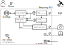

Pycontrol
=========

Pycontrol is Linux-based camera control software running on a Raspberry PI 4 (or
later) that automates digital photography of solar eclipses and transits,
allowing the user to focus on observing the celestial event. It calculates local
eclipse event times from user-entered or GPS-provided coordinates and uses an
easy to write camera sequence files to pre-program camera settings and timing
for a series of exposures.

Once configured, all that is needed is:
1. A Raspberry PI
2. A USB GPS antenna
3. A Digital USB camera supported by `libgphoto2`
4. A power brick to power the Raspberry PI
5. A mobile pone with a webbrowser for control and monitoring

In the field, just power it up, after boot, join its WIFI network and browse to
the webapp and monitor the countdown to the events in progress, verify the GPS
signal is workign and that the correct camera is detected in real-time.

More than one camera can be connected and controlled.

Only Nikon cameras have been tested as these are on hand and well supported by
libgphoto2.

Killer Features
===============

1. **Hot Pluggable** Unplug the GPS or camera USB cable at any time.  The
software can handle it.

2. **Portable** Runs on a Rasbperry PI, so you can take it anywhere!

3. **Real Time Feedback** Connect your phone's browser to the webapp, and watch
the count down timers.

4. **Default is real-world** When the Raspberry PI boots, it loads the last event
and sequence setup and uses the GPS antenna and is ready to go!  Running any
simulation turns the user interface
<span style="color: #ff1111;"><strong>RED</strong><span> to let you know.

5. **High Contrast UI** When things are
<span style="color: #96d53f;"><strong>GREEN</strong><span>, you're good to go!
See any <span style="color: #ff1111;"><strong>RED</strong><span>, and you've got
to take action!

Design
======



Using systemd startup configuration files, on boot up, the raspberry pi will launch
the Python Flask webapp and C++ camera_control_bin.  Connecting to the WiFi network
`pycontrol` using the wifi password `spain2026` will bring you to the webapp user
interface.  From here you will see something similar to:


Configuration files
===================

Event files
-----------

Event files define what kind of event is being tracked.  Currently there are
only two event types supported: `custom` and `solar`.

Total Solar Eclipse Events
--------------------------

Total solar eclipse events are fully supported, the event file format is:
```
type solar
date YYYY-MM-DD
event_ids c1 c2 mid c3 c4
```
For example, the 2026 total solar eclipse can be defined with:
```
type solar
date 2026-08-12
event_ids c1 c2 mid c3 c4
```

The event solver python code will perform a coarse search +/- 24 hours around
this date to locate `c1` or contact 1.  If found, the code will then fine tune
the contact times for the entire total solar eclipse.  This code has been
verified to match Xavier M. Jubier's tables for `c2`, `mid`, and `c3` within 1
second.

Runing `webapp/solar_eclipse_contact_times.py` will compute conact times and
compare with Xavier's result for various locations.  `c1` and `c4` is less
accurate, within 10 seconds but these events are less critical to me and most
photographers I would guess.

Custom Events
-------------

I have not written a Lunar Eclipse solver yet.  Since a Lunar eclipse is much
slower and less dramatic, we can manually define Lunar eclipse event using the
custom format:
```
type custom
date YYYY-MM-DD
event_ids EVENT_IDS+
EVENT_ID YYYY-MM-DDThh:mm:ss.fffZ
```
For example:
```
type custom
date 2026-08-13
event_ids e1 mid e2
e1  2026-08-13T05:00:00.000Z
mid 2026-08-13T07:00:00.000Z
e2  2026-08-13T09:00:00.000Z
```

The format expect a list of event ids specified, and for each event_id, a full
date and time specifed in UTC.

This should work for lunar eclipses or ISS conjuctions with the Sun or Moon.

Camera Descriptions
-------------------

Currently using libgphoto2, the serial number of the camera is detected, and a
make and model is used for the camera description.  It's ecpected that a user
will want to rename this to something short and simple for the purposes of
looking at the user interface and for scripting a camera sequence.

`config/camera_descriptions.config` will store any maping for serial numbers to
short name.  The format is:
```
SERIAL_NUMBER alias_name
```
For example:
```
12345 z7
67890 z8
```

Camera Sequences
----------------

The camera sequence is where you'll spend most of your time with writing and
testing.  The general format is:

```
EVENT_ID    OFFSET    CAMERA_ID.CHANNEL    VALUE
```

For example, suppose I have a Nikon Z7 aliased to `z7`, this sequence will set
up the exposure settings and trigger the camera 7 seconds before the `c2` total
solar eclipse event:
```
c2    -8.0    z7.quality          NEF (Raw)
c2    -8.0    z7.iso              800
c2    -8.0    z7.shutter_speed    1/800
c2    -8.0    z7.fstop            f/8

c2    -7.0    z7.trigger          1
```

The event offset time can also be expressed in hours:minutes:seconds.fraction,
for example:
```
c2   -01:20.0   z7.iso   800
```
shows 1 minute and 20 seconds before contact 2.

Hours can be spcified, for example:
```
c2   -1:00:30.5   z7.iso   800
```
shows 1 hours and thirty and a half seconds before contact 2.

The unit test file `src/camera_control/CameraSequenceFileReader_uto.cc` should
contain living documentation for the supported channels and formats.

Camera Sequence Speed Testing
-----------------------------

**WARNING**!  As currently written, PyControl will trigger the camera for all
the trigger events in the camera sequence file.  It currently does not skip
triggering your camera if it's falling behind.  That is, if you created a
sequence to trigger your camera 30 times over 10 seconds, if you camera can't
actually achieve 3 FPS, the sequence will actually take longer than 10 seconds
to execute.  Therefore, it's crictical to test out the timing of your sequences
well beforehand so you understand what your camera can achieve.

The software could be updated to auto drop trigger events when it's falling
behind, but that would mean you'd randomly drop frames.  I would rather setup
for success throuh testing before and have confidence my sequence will capture
everything I've scripted.

`libgphoto2` produces camera events that `camera_control_bin` will detect and
count the number of shots taken, this will be displayed in the camera table on
the webapp user interface.  When triggering a timing test, you can easily see
the number of triggers by lookig at `Shots Taken`.  It's also important to look
at the timestamps of the first and last file in the sequence to verify the
timestamps to know if your camera could keep up.  I do this by disconnecting the
camera from USB (to take control from the computer) and look at the image
timestmaps.  I usually format the memory card before each timing test to make it
easy to navigate and understand the frames captured during the timing test.
Unplugging the camera's USB connection the to Raspberry PI also resets
`Shots Taken`.

The folder `sequences` has some pre-made timing tests to help you figure
out how fast you can successfully trigger your camera.  For example:
`sequences/c2_2.0_fps.seq` can be used with a total solar eclipse event that
will trigger the camera 60 times over 30 seconds.  You can load this sequence
and run a simulation that starts about 20 seconds before `c2` to verify if your
camera can indeed capture at 2 FPS over usb via `libgphoto2`.  Some of my
measurements:
```
Nikon Z7 - 2.33 FPS
Nikon Z8 - 4.66 FPS
```
The above is **without** using `burst_number` with the camera setup in single
shot capturing RAW files.

It's possible to use `burst_number` on Nikon, providing you can configure the
`capture_mode` channel correclty for your camera.  As of writing
(September 2025), `capture_mode` is not well supported on the Nikon Z cameras
with libgphoto2.  I have a branch of `libgphoto2` that adds better support for
the Nikon Z7 and Z8 that I hope to one day get a pull request accepted that
adds better enumations / strings for `capture_mode`.

See `sequences/z7_2.0_fps.seq` and `sequences/z8_5.0_fps.seq` for my experiments
with `burst_number`.


Getting Started
===============

1) Acquire a Raspberry PI 4 with 4 GB of RAM.
2) Install the default Raspberrian OS.
3) Setup a user and password so you can login
4) Setup using a static IP on your local network over IPv4
5) After the Raspberry PI boots up, ssh into your new account
6) Configure an ssh key on your development box and transfer the trusted public
   key to your raspberry pi, also known as passwordless login. See `ssh-copy-id`.
7) Apply the system configuration as I've tried to document via `ansbile`, see
   the [ansible/README.md](Raspberry-pi-4/ansible/README.md).
8) Now you can try building the project.


Building the project
=====================

We need to install the folling dependencies for building on your local linux box:
```
cmake
g++
gettext                # gphoto2
git
libcurl4-gnutls-dev    # libgphoto2
libexif-dev            # libgphoto2
libgd-dev              # libgphoto2
libgtest-dev
libltdl-dev            # libgphoto2
libpopt-dev            # gphoto2
libprotobuf-dev
libusb-1.0-0-dev       # libusb-dev
libxml2-dev            # libgphoto2
libgettextpo-dev       # gphoto2
make
meson                  # libgphoto2
protobuf-dev
python3.12-venv
```

Setp 1: Build using make
------------------------
```
make
```

To build with verbose messages:
```
make VERBOSE=1
```

Step 2: Build on the Raspberry PI
---------------------------------
```
./remote-build.bash make
```

This will run `rsync` to transfer the local `pycontrol` project source files to
the Raspberry PI, then execute `make`.
